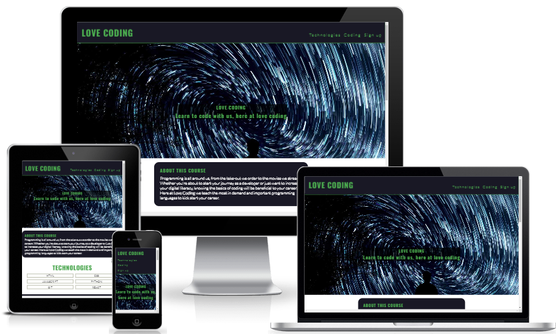
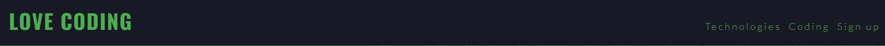
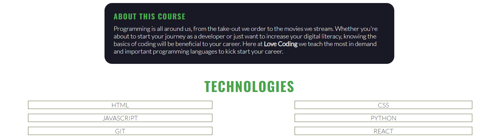
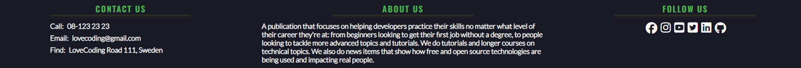
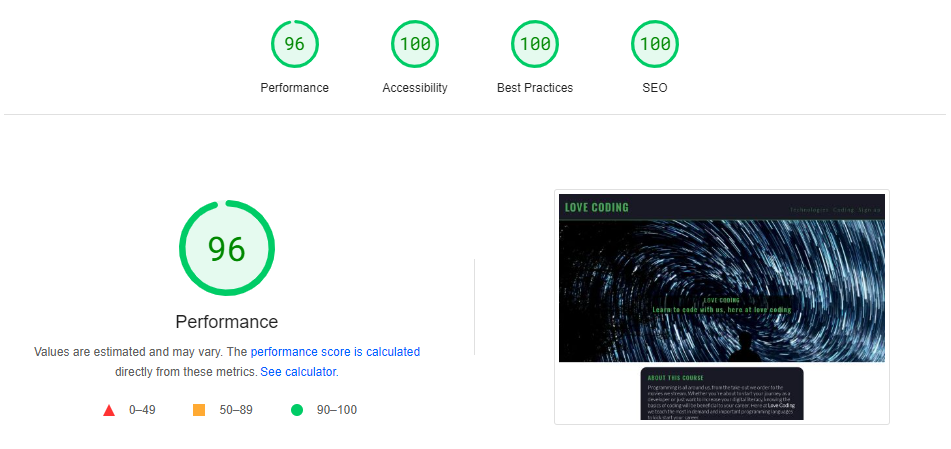

# Code Loving

<a href="https://berger101.github.io/codeLoving/">Code Loving</a> is a publication that focuses on helping developers practice their skills no matter what level of their career they're at: from beginners looking to get their first job without a degree, to people looking to tackle more advanced topics and tutorials. We do tutorials and longer courses on technical topics. We also do news items that show how free and open source technologies are being used and impacting real people.

### Contribution Bug
<ul>
  <li>There was a bug where the site now have two contributors, same person but two different accounts, the bug is explained down below at the bug section.</li>
</ul>

## Wireframes

 

## Features

Navigation
<ul> 
  <li>Featured at the top of the page, the navigation shows the club name in the left corner: CODE LOVING that links to the top of the page.</li>
  <li>The other navigation links are to the right: Home, Technologies and Sign up which link to different sections of the same page.</li>
  <li>The menu is in a fixed position which makes it easy to navigate around the page when scrolling.</li>
</ul>

The Hero
<ul>
  <li>The hero image shows the name of the site, continuing the sites font color and theme.</li>
  <li>The hero image explains that the site is for teaching code.</li>
  <li>This section explains that it is for users who wants to learn how to code.</li>
</ul>

Technologies Section
<ul>
  <li>The technologies section give insight on which technologies is available to learn from the site and what it's all about.</li>
  <li>The section has information on what Love Coding promises to it's students and what we focus on.</li>
  <li>The section shows the user what programming languages you can learn from joining the course.</li>
</ul>

Coding Section
<ul>
  <li>The coding section promises what you will gain from joining the course.</li>
  <li>The section have a image with some code seen trough the lens of some glasses.</li>
</ul>

Sign up Section
<ul>
  <li>The sign up section has a form to register for a newsletter.</li>
  <li>The form register a username and an email address.</li>
  <li>The sign up form is important to the user to keep updated on important changes and news to come.</li>
  <li>The sign up section have a image shown in desktop view but the image is removed for mobile view.</li>
</ul>

Footer
<ul>
  <li>The footer invites the user to three different parts a contact us, about us and follow us section.</li>
  <li>The contact section show the user how you can get in contact with the Love Coding company.</li>
  <li>The about us section contain text on what the course is about.</li>
  <li>The follow us section includes links to the relevant social media sites for Love Coding.</li>
</ul>

## Testing

<ul>
  <li>I tested that this page works in different browsers: Chrome, Firefox, Safari.</li>
  <li>I confirmed that this project is responsive, looks good and functions on all standard screen sizes using the devtools device toolbar.</li>
  <li>I confirmed that the navigation, header, Home, Technologies and Sign up text are all readable and easy to understand.</li>
  <li>I confirmed that the form works: requires entries in every field, will only accept an email in the email field, and the submit button works.</li>
</ul>

## Bugs

<b>Solved bugs</b>
<ul> <b>Image bug</b>
  <li>When I deployed my project to GitHub Pages I discovered that one image file path was broken due to me changing the filename from camel case to only small letters.</li>
  <li>I discovered that the change of name did not update in the GitHub repository.</li>
  <li>Removing the image from the GitHub repository and uploading it again fixed the problem.</li>
</ul>

<ul> <b>Contribution bug</b>
  <li>When I updated my README file I realized that my commits from VS Code came from my old GitHub account and the README update from my new GitHub account therefore having two contributors.</li>
  <li>Having already changed the GitHub account on VS Code and removed the old GitHub account windows credentials for the new one and still having the issue I realized that the bug still remained too late.</li>
  <li>Furthermore to the previous fix, removing the .gitconfig file in C:\Users\user and restarting VS Code fixed the bug.</li>
</ul>

## Validator Testing

HTML
<ul>
  <li>No errors were returned when passing through the official <a href="https://validator.w3.org/">W3C validator</a>.</li>
</ul>

CSS
<ul>
  <li>No errors were found when passing through the official <a href="https://jigsaw.w3.org/css-validator/">(Jigsaw) validator</a>.</li>
</ul>

Accessibility
<ul>
  <li>I confirmed that the colors and fonts chosen are easy to read and accessible by running it through the official <a href="https://pagespeed.web.dev/">lighthouse (PageSpeed) validator</a>.</li>
</ul>

## Deployment

The site was deployed to GitHub pages. The steps to deploy are as follows:
<ul>
  <li>In the GitHub repository, navigate to the Settings tab</li>
  <li>From the Source section drop-down menu, select the Main Branch</li>
  <li>Once the main branch has been selected, the page provided the link to the completed website</li>
</ul>
The live link can be found here - <a href="https://berger101.github.io/codeLoving/">Love Coding</a>

## Credits

Content
<ul>
  <li>The text from the Coding section and the footer was taken from <a href="https://code-love.com/page/5/">code-love</a></li>
  <li>The icons in the footer were taken from <a href="https://fontawesome.com/">Font Awesome</a></li>
  <li>The icons in the sign up section were taken from <a href="https://fonts.google.com/icons">Google Fonts</a></li>
</ul>

Styling
<ul>
  <li>The styling for the header and menu was largely taken from the CI <a href="https://code-institute-org.github.io/love-running-2.0/index.html">Love Running</a> project.</li>
</ul>

Media
<ul>
  <li>The hero image was taken from <a href="https://picsum.photos/">Picsum</a></li>
  <li>The images from Coding and Sign up section was taken from <a href="https://unsplash.com/">Unsplash</a></li>
</ul>
